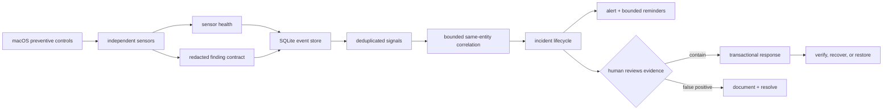

# Aegis layered-defense architecture

## Security objective

Aegis is a local **Observer** with human-approved response, running on macOS,
Linux and Windows. Its job is not to make one detector look infallible; it is
to arrange independent, imperfect controls so that an attack missed by one
layer can still leave evidence in another. A sensor failure is data, never a
clean result.

The non-negotiable boundary is:

- Observer Basic may sample, diff, correlate, alert, quarantine a named object,
  and recover that object. It does not authorize process, file, or network events.
- It does not request root/administrator or Full Disk Access for a shared interpreter.
- It does not execute suspect samples on the host.
- It does not let an LLM or heuristic automatically take response authority.
- Power-tier blocking requires OS-privileged interception the unprivileged tier
  deliberately forgoes: on macOS a signed/notarized app with the Apple-approved
  Endpoint Security entitlement (plus a Network Extension for filtering); on
  Linux a root-privileged eBPF/fanotify/audit agent; on Windows a kernel
  minifilter or an ELAM/PPL-signed AV service registered with the OS.

## Platform strategy

One stdlib-only file detects its OS at import and selects the sensor registry,
path tables, trust model, scheduler and change-detection mechanism for that OS.
Three rules keep this honest rather than merely portable:

1. **A sensor with no meaning on a platform is absent, not degraded.** Reporting
   a launchd check as a failed sensor on Linux would manufacture a permanent
   fake coverage gap and train the operator to ignore health warnings.
2. **The trust model is per-OS, because "who vouches for this binary" genuinely
   differs.** macOS and Windows have ambient code signing, so unsigned/ad-hoc in
   a user-writable path is itself the signal. Linux has none — every locally
   built binary is unowned by any package — so treating "unmanaged" as
   suspicious would bury a developer in false positives. Linux therefore keys
   its exec signal on *structure* instead: execution from a volatile directory,
   or a running process whose executable has been unlinked from disk.
3. **Everything above the sensor line is shared.** The finding contract,
   redaction, event store, dedup, correlation and path lineage, incident
   lifecycle, typed dismissals, risk accumulation, sensor health, the
   transactional quarantine store, replay, and the heartbeat all operate on
   platform-neutral records, so a detection cannot be well-managed on one OS
   and sloppily managed on another.

## Swiss-cheese layers

| Layer | Control | Failure it covers |
|---|---|---|
| Prevent | Per-OS preventive posture: Gatekeeper/SIP/FileVault/firewall (macOS), SELinux-AppArmor/ufw-firewalld-nftables/LUKS/sshd exposure (Linux), Defender RTP + tamper protection/firewall profiles/BitLocker (Windows) | Reduces exposed paths before Aegis observes anything |
| Observe | Persistence, processes/argv, hot directories, staging, shell + PowerShell history, hosts-file web/phishing posture, canaries, listeners, outbound, extensions, wallet integrity, developer supply chain — plus the OS-specific surfaces: XProtect/BTM/profiles (macOS), kernel modules and setuid-root binaries (Linux), WMI subscriptions and Defender exclusions (Windows) | Independent artifacts left by execution, persistence, credential theft, staging, redirection, or tampering |
| Attribute | Download provenance from `QuarantineEventsV2` and the Chrome-family `downloads` table (macOS); OS security-log harvest elsewhere (`auth.log`/journal on Linux, the Security/Defender/PowerShell event channels on Windows) | Turns "an unsigned binary appeared" into "who fetched it, from where" — and grades the finding accordingly |
| Prove coverage | Durable per-sensor status, duration, item count, consecutive failures | Prevents an unavailable permission/tool from being reported as clean |
| Normalize | Versioned finding contract and central redaction | Makes signals comparable without persisting command-line secrets |
| Correlate | Same-entity bounded-window chains **plus durable path lineage** | Raises confidence when independent layers agree; lineage additionally links a drop to an execution that happens after any bounded window has closed |
| Manage | Durable incidents, evidence links, validated lifecycle, bounded reminders | Keeps work visible after a desktop notification disappears |
| Tune | Typed dismissals (false- vs benign-positive), per-sensor down-weighting, documented benign causes, read-only replay | Keeps the operator trusting the tool: a noisy detector is measurable and correctable instead of being muted wholesale |
| Pre-commit | Latched persistence surfaces (`chflags uchg` / deny-write ACE) and FIFO credential decoys, both placed **before** any attack | Makes the attacker's write fail rather than reporting it afterwards; a cleared latch or a read decoy is attack-defined evidence |
| Contain | Manual process action, **reversible freeze**, and transactional file/app quarantine | Stops a reviewed threat while retaining reversible evidence |
| Prove detection | Positive-control assay per detector, with an efficacy half-life; every lane asserts **both** poles, and the delegate/session tier is covered too | Distinguishes "nothing found" from "no longer able to find"; unproven coverage is reported as unproven. A hostile-pole-only lane passes against a detector hardwired to say yes, and a benign-pole-only lane passes against a dead one — so a lane that checks one pole proves nothing |
| Delegate-surface | Agent config discovered by **shape** (a `command`+`args` pair under an agent directory), hashed by **resolved target** rather than by config line, plus a semantic imperative detector for instruction files and a **chain-of-custody grade** for each structural change (signed intent ledger, then git provenance, then signer stability) | An AI agent runs with the operator's full authority and takes instruction from files; an MCP registration is exec-on-start, a hook body is exec-per-tool-call, and a natural-language imperative is an execution primitive with no shell syntax for any grammar to match |
| Session | Browser automation aimed at the **live** profile (debug port, sideloaded extension, real `--user-data-dir`), plus session-binding posture | Post-App-Bound-Encryption, cookie theft is the browser being driven against itself rather than a jar being copied; live cookies defeat MFA and their revocation belongs to the counterparty |
| Recover-plan | Dependency-ordered revocation derived from the credential artifacts actually present on disk | The question after a theft is not "what happened" but "which accounts are theirs, in what order do I take them back" — and rotating in the wrong order hands over the reset link |
| Witness | Hash-chained state anchored into the OS's root-owned log store | An attacker who tampers, or who stops the monitor, cannot do so silently |
| Recover | Exclusive restore, verified delete, crash recovery, audit | Handles false positives and interrupted response without silent data loss |

## Data and decision flow



Every observation becomes an `events` row. A stable fingerprint upserts a
`signals` row and increments its occurrence count. High-confidence related
signals can share an incident; the event-to-incident links preserve the evidence
that justified escalation. Raw events are bounded while materialized signals,
incidents, and response transactions remain durable.

## Correlation rules

The current rules intentionally trade breadth for explainability:

- **ClickFix/fileless execution:** fetch-and-execute behavior plus persistence
  involving the same entity becomes a CRITICAL chain.
- **Persistence execution:** a persistence change plus risky execution of the
  same entity becomes a CRITICAL chain.
- **Remote access:** persistence changes plus a newly reachable
  listener for the same entity become a CRITICAL chain.
- **Supply chain:** background-item installation/change plus suspicious
  execution of the same entity becomes a CRITICAL chain.
- **Credential capture:** a password phish, `dscl -authonly` check, keychain
  access, or GUI-kill coercion, plus persistence/staging/exfil on the same
  entity, becomes a CRITICAL chain. Each stage is individually explainable;
  together they are the infostealer kill chain.
- **Path lineage (not time-boxed):** a suspicious drop is remembered durably by
  normalized path, and any later execution or persistence of that path becomes a
  CRITICAL chain regardless of elapsed time.

An uncorrelated HIGH or CRITICAL signal still opens an incident. An unrelated
single MEDIUM signal is recorded but does not become an incident. Correlation is
deterministic code with inspectable evidence; it is not an AI verdict.

### Why lineage is keyed on the path

The bounded window cannot express the standard 2025-26 sequence: a dropper writes
a payload and exits, and a *different* launchd job executes it at the next login.
Widening the window trades precision for a case it still would not reliably
cover. Content hashes are also the wrong key, because droppers re-sign the
payload between stages, changing the hash while the code stays identical. The
path is the one identifier that must remain stable for the attack to function, so
lineage joins on it — retained for six months, then forgotten.

### Risk accumulation

Weak signals that never notify alone accumulate per entity, weighted by severity
× confidence. Two refinements keep this honest:

- **Corroboration is scored, not just counted.** Signals from two or more
  distinct sensors receive a score multiplier against a *constant* threshold —
  independent sensors agreeing is stronger evidence than the same count from one
  sensor. The single-sensor path keeps its original bar, so no previously
  escalating detection stops escalating.
- **Precision feedback.** A category the operator repeatedly dismisses is
  down-weighted toward a floor (never to zero, so it can still corroborate), and
  only after a minimum sample, so one dismissal cannot mute a sensor. Reopening
  an incident retracts its dismissal.

## Incident workflow

Allowed states are `OPEN`, `ACK`, `INVESTIGATING`, `CONTAINED`, `RECOVERING`,
`MONITORING`, `RESOLVED`, and `FALSE_POSITIVE`. Transitions are validated so a
closed incident cannot silently return to containment. An unresolved incident
gets at most three reminders (about +1 hour, +24 hours, and +72 hours); afterward
the durable open state is the reminder. A reviewed `FALSE_POSITIVE` suppresses
only the exact correlation key while retaining later occurrences as evidence;
a changed content hash gets a new key (unless *acquired tolerance*, below, has
earned the right to pre-close it). A `RESOLVED` threat that recurs opens a
new incident instead of being silently ignored.

```text
OPEN -> ACK -> INVESTIGATING -> CONTAINED -> RECOVERING -> MONITORING -> RESOLVED
                         \------------------------------------------> FALSE_POSITIVE
```

Use `aegis.py incidents`, then `aegis.py incident ID ACTION`. Response remains a
separate explicit step; creating an incident never quarantines or kills anything.

Dismissal is **typed**, because the two kinds need opposite handling and merging
them is what makes a detector impossible to tune:

- `false-positive` — the detection logic was wrong; the rule needs tuning.
- `benign-positive` — the event was real but authorized; the rule is working.

Both suppress the same way (identical semantics, `FALSE_POSITIVE`), but they are
recorded separately so the tuning queues and the per-sensor precision feedback
can tell a broken rule from an expected-but-noisy one. Each incident card also
prints the documented benign causes for the sensors that fired, so triage is a
match against a known list rather than an investigation.

### Acquired tolerance

Exact-key suppression cannot absorb the dominant benign churn: a vendor updater
rewrites the same plist on every release, so the same reviewed identity re-opens
a fresh HIGH incident per update, forever. Acquired tolerance is the
identity-level memory over the operator's own verdicts, with immune-system
guards because they answer the same adversarial pressures:

- Only **human `benign-positive` verdicts teach** — `false-positive` labels tune
  rules instead, and machine verdicts write no dismissal record, so tolerance
  can never feed on itself or pollute `backtest` precision.
- **Antigen-specific**: the identity is the fingerprint minus its trailing
  content hash, with dotted version segments normalized inside path-like
  fields only (a vendor's versioned install dir renames every release), and
  only categories whose benign churn is hash- or version-shaped are eligible
  (an allowlist). A beacon's endpoint, a base path, a marker set are facts —
  a new one is a new incident, always.
- **Repeated exposure required**: three distinct dismissed incidents on the
  identity inside 180 days, so one hasty dismissal teaches nothing.
- **Inflammation overrides**: never `CRITICAL`, never above the severity the
  operator actually reviewed, never for attack-defined evidence (decoys,
  latches, canaries), and never while the operator is *in dispute* with the
  identity — a status they moved an incident to, or an explicit `reopen`.
  Dispute used to mean any active incident, which read silence as objection:
  a noisy identity was suppressed by its own untriaged backlog, so verdicts
  on it could never take effect and tolerance engaged only where it was not
  needed. On the reference machine that put all 27 open incidents in dispute.
- **Visible and disputable**: the incident is still created with its full
  evidence, closed as `auto-tolerated` citing the precedent count, counted in a
  footer on the active listing, and one `reopen` both re-alerts and revokes the
  tolerance (reopening deletes the dismissal rows the count was built on).

### Chain of custody (all sensors)

The dominant benign churn on the delegate surface is not vendor updates — it is
the operator's *own* agent tooling registering hooks, MCP servers, and skills,
often through the operator's own git remote. Provenance that only asks "is this
commit on a remote?" labels all of it with the poisoned-repo warning, and nine
self-inflicted HIGHs in one day is how the one foreign HIGH eventually gets
dismissed unread. Custody grading answers the question that actually
discriminates: **can this machine claim authorship of this change?**

Custody began on the delegate surface and now grades every sensor. Two
families of rung, in order; the first that vouches sets the grade. The
**authorship** rungs (1-4) answer *did this machine make this change?*; the
**origin** rungs (5-7) answer the weaker but far more common question *did
this arrive through something the operator set up?*

1. **Signed intent ledger** (`~/.aegis/intent.jsonl`). The agent harness calls
   `aegis.py intent hook <tool>` after each file-writing tool call; Aegis
   appends one HMAC'd `{ts, path, sha256, tool}` record. A change whose content
   hash matches a valid record is `self-attested` → **LOW**. This covers what
   git cannot: untracked files and binaries outside any repo.
2. **Git self-vs-foreign**. A commit is `self-committed` → **LOW** only when two
   independent records agree: its author email equals the repo's configured
   `user.email`, *and* the HEAD reflog remembers it being **created** here (a
   local commit enters the reflog as `commit:`; a pulled one as
   `pull:`/`merge:`/`clone:`, never `commit:`). Reachable from a remote with no
   local authorship record is `remote-foreign` → **HIGH** with the
   poisoned-repo warning — pushing your own commit does not make it foreign,
   and pulling someone else's never becomes yours.
3. **Fleet signature** (the multi-device rung). A commit that arrived from
   elsewhere but carries an SSH signature verifying against the **pinned**
   device roster (`~/.aegis/allowed_signers`) is `fleet-signed` → **LOW**: it
   was made on one of the operator's own machines, and a signature is the one
   custody evidence that survives transport. The roster is written only by the
   explicit `signers pin` command — a roster synced or tracked through the repo
   itself is merely the *source* the operator pins from, so a poisoned remote
   that adds an attacker key to the tracked copy changes nothing until a human
   re-pins. Verification is asymmetric: this machine holds nothing that can
   *make* a trusted signature, only what checks one. Only an exact `G` verdict
   vouches; unsigned, bad, unknown-key, expired, and error are all non-matches.
4. **Signer stability** (changed-target findings only). A resolved target
   re-signed by the **same team** that signed its baselined content is the
   exact shape of a vendor updating its own binary → **MEDIUM** (recorded, can
   corroborate, opens no incident alone). The team is captured at snapshot
   time, so an old baseline without one fails toward HIGH, never toward quiet.

The origin rungs exist because the delegate surface was never where the volume
was. `persistence.diff`, `process`, `net-listener`, `net-outbound` and
`net-beacon` scored on code signature plus path writability alone — two axes on
which a Homebrew daemon, a VSCode extension helper and a dropped payload are
indistinguishable, because ad-hoc signing in a user-writable path describes all
three. A single directory migration could therefore produce sixty HIGHs beside
a genuine intrusion. These rungs demote **one step only** (never to LOW, with
the one exception noted): origin is not authorship, and a package can be
malicious, a publisher can ship a bad build, a stolen certificate signs cleanly.

5. **Relocated** (changed persistence item) → **LOW**, the one origin rung that
   goes that far, because it is a proof about *content* rather than about
   provenance: the program bytes and the payload script's own hash are both
   byte-identical to the baseline and only the directory changed. Nothing new
   executes, so there is nothing to grade. It requires proof on **both** halves
   of what a job runs — requiring only the program hash would be worthless for
   the dominant `<interpreter> <script>` shape, where the program is `/bin/bash`
   and identical by definition while the script is the half that could have been
   swapped. This is why persistence snapshots hash `script_target` at all (see
   below); when a baseline predates that hashing the rung is refused outright,
   since an unproven half is not a passing half.
6. **Publisher stability** (changed persistence item) → **MEDIUM**. The binary
   changed in place but carries the **same signing authority** as its baseline,
   and that authority is Apple/App-Store/Developer-ID. This is the literal shape
   of a vendor auto-update — the Microsoft, OneDrive and Zoom updaters rotate
   their own bytes on a schedule. A different signer, or an unsigned rebuild, is
   never this rung.
7. **Package receipt** (binary-keyed findings) → **MEDIUM**. The binary is owned
   by a package-manager transaction on this machine, proven by reading that
   manager's **receipt** — Homebrew's `INSTALL_RECEIPT.json` beside the
   versioned Cellar root, the editor's own `extensions.json` index, pipx's
   `pipx_metadata.json` at the venv root, and the `BUILD` stamp uv writes into
   each interpreter it manages under `uv/python/<dist>/`. It is deliberately *never* a path
   prefix: treating `/opt/homebrew/…` as a trust rule would vouch for anything
   an attacker drops into a directory the user can write to, which is precisely
   the file being graded. Both the link and its target are probed, because the
   managers point in opposite directions — Homebrew's `bin/` entries are
   symlinks *into* the Cellar, while a venv's `bin/python` is a symlink *out* to
   the system interpreter. A hand-installed binary (an unpacked CI runner, a
   curled release tarball) has no receipt and correctly keeps its severity.

Two weak git rungs that the ladder previously named and then ignored:
`worktree` and `local-commit` printed "routine if you made it" while the finding
stayed HIGH. They now demote **one step**, not to LOW — an uncommitted local
edit is also exactly what a local attacker's change looks like, so it earns
quiet rather than silence.

Guards, because grading is where an attacker would want to stand:

- **Grades, never mutes.** A downgraded finding is still created, still in the
  report, still accumulates risk and joins correlation chains. Custody writes
  no dismissal and cannot feed acquired tolerance.
- **Attack-defined content never downgrades.** A conceal imperative stays HIGH
  even when self-attested — an agent prompt-injected into persisting a hostile
  instruction attests its own write. Custody grades *churn-shaped structure*,
  not content; the imperative detector keeps its own judgement.
- **Fail toward suspicion.** Bad MAC, stale record, expired reflog, identity
  mismatch, git error, absent signer — each is a non-match, and a non-match
  keeps HIGH. The failure mode of every rung is the pre-custody behavior.
- **Forgeability is stated, not hidden.** The MAC key and the reflog are
  same-uid-writable, so an attacker *already executing as you* can forge both.
  That is the wrong threat for this surface, which exists to catch hostile
  instructions at **arrival** — the poisoned repo, the trojaned config, the
  malicious skill — i.e. before the attacker has local execution, which is the
  only moment forging is impossible. Post-compromise silencing is the witness
  layer's problem, and it is exactly as detectable as it was before custody
  grading existed.

#### Severity layering order

Each grading layer is monotonic on its own, but they push in different
directions, and the order they compose in is a contract, not an accident of
call sequence:

1. **Sensor ladder** sets the base severity (e.g. `_persistence_severity`,
   with a HIGH floor for program/target swaps).
2. **Custody** (`_demote`) only ever steps DOWN, and never touches
   attack-defined evidence.
3. **Writ enforcement** (`_apply_writ`) runs AFTER custody and is deliberately
   bidirectional: a covered change drops to INFO, an uncovered change is
   promoted to at least HIGH — under enforcement, the *absence of a record*
   outranks provenance, which is the entire point of opting in.
4. **The notify floor** (`emit`) routes by the final severity; it never
   changes one.
5. **The incident ratchet** (`_severity_max`) only ever steps UP: once an
   incident opened HIGH, a later regrade of the same subject cannot quietly
   lower it — de-escalation is the operator's verdict to give, not custody's.

One known asymmetry, stated so it is a decision rather than a surprise: a
custody demotion below HIGH keeps a finding out of the *standalone-signal*
incident path (the uncorrelated-signal floor). That is routing, not erasure —
the finding is still logged, still joins chains and lineage, and still
accumulates risk — but "grading demotes, it never suppresses" is true at the
report tier and only mostly true at the incident tier.

#### Hashing the payload, not the interpreter

Custody's relocation rung forced a gap in the persistence sensor into the open.
A launchd job or systemd unit is overwhelmingly `<interpreter> <script>`, and
the snapshot recorded only `program` — so it hashed `/bin/bash` and said nothing
about the file that actually carries the behaviour. Rewriting that script left
program, args and env all identical, and `check_persistence` emitted **no
finding at all**: a payload swap under a stable config was invisible to the one
sensor whose whole job is watching what runs at boot.

Snapshots now carry `script_target` and its `target_sha` on every platform (the
shared record helper, so launchd plists, systemd units and Run keys all inherit
it), a change in that hash is a reported change rated with a swapped binary, and
the same evidence is what lets a genuine relocation be told apart from a
substitution. The hash is required on **both** sides before either conclusion is
drawn — a field merely appearing as an old baseline rolls forward is not a swap,
and must not alert on every job at once.

`aegis.py replay [days]` re-runs the current correlation logic over recorded
history in a throwaway in-memory database. It is strictly read-only — no
incident, no notification, no durable write — so a detection change can be
backtested before it ships.

## Signal-to-noise tier

A detector is only as good as the attention it still commands. Measured on the
reference machine 2026-08-20, before this tier existed: 281 incidents lifetime,
131 adjudicated `FALSE_POSITIVE`, 129 still `OPEN`, and no true positive that a
test fixture had not planted. The sensors were not blind — the output was
unreadable, which is the worse failure, because it silences every future alert
too. Five mechanisms address it, and each one that suppresses something must
prove what it still says.

**Exec identity is what runs, not where it sits.** An exec-capable config entry
is keyed on its command and arguments (`_exec_identity`), never on its position
in the file. The positional key it replaced (`hooks.SessionStart[4].hooks[0]`)
renumbered every later sibling whenever one was inserted, so a single added hook
re-alerted the whole list: 55 of 67 un-generalizable open incidents were that
cascade. Both sides of the diff are normalized (`_migrate_exec_keys`), so an
upgrade from a legacy baseline is silent rather than presenting every baselined
entry as new. A genuinely new command still fires at `HIGH`.

**Rotating endpoints generalize only on evidence, at two widths.** A beacon's
address is a fact and a new endpoint alerts — but a rotating service re-opens
forever. `_beacon_endpoint_classes` offers two classes, narrowest first, and
`_rotating_endpoint_memory` grants one only on the matching evidence:
`<path>:#ip:<port>` (a service on a fixed port answering from rotating
addresses — a CDN, an update channel) needs `_ROTATING_MIN_ENDPOINTS` distinct
addresses; `<path>:#ip:#port` (a peer-to-peer client, which varies address and
port together by design) needs that many distinct address:port pairs spanning
`_ROTATING_MIN_PORTS` distinct ports, so it is strictly harder to earn.

The second width exists because the first was not enough for real software:
Syncthing's dismissed endpoints on the reference machine spanned five ports and
five addresses, so no fixed-port class could reach its threshold and six human
verdicts taught nothing. Note also that a beacon fingerprint is
`beacon:<path>:<ip>:<port>` and an IPv6 address contains colons — the address
is parsed from the right (`_BEACON_FP_RE`), never by splitting on ':', which
silently folded the address into the path and made every IPv6 beacon
un-generalizable. Hostnames never generalize; attack-defined prefixes never do.

**Aegis's own upgrade is attested, not exempted.** `_install_runtime_copy`
writes one ordinary intent record for the runtime copy it installs, so the same
custody ladder every other surface uses grades the change (`HIGH` -> `LOW`,
still reported). A payload swapped by anything that did not come through
`install` records nothing and stays `HIGH`. Persistence changes now also grade
the *payload* against the ledger, not only the config file naming it — the
dominant `<interpreter> <script>` job mutates by having its script rewritten.

**Incidents age out.** An `OPEN` signal or risk incident with no new evidence in
`_AGE_OUT_DAYS` closes as ambient, retained and reopened by recurrence. Never
CRITICAL, never a correlation chain, never attack-defined evidence — a quiet
week is not an acquittal for a tripped decoy. Machine verdicts write no
`dismissals` row, so they cannot feed tolerance or backtest precision.

**The learning period.** A fresh install starts a `_LEARNING_DEFAULT_DAYS`
window (`aegis.py learn`) in which everything is recorded and correlated but a
non-CRITICAL signal opens pre-closed as `learning` instead of alerting. A
detector's first weeks on a real machine are its worst: every ordinary thing it
has not yet seen is new by construction. CRITICAL chains and tripped
decoys/latches always alert.

**One routing gate, consulted by both tiers.** The interrupt tier (`emit`:
allowlist, seen-ledger, adoption, notify floor, confidence) and the incident
tier (acquired tolerance, the learning period) were disjoint state machines
coupled by a single per-scan boolean, and three things followed. Acquired
tolerance never muted the desktop notification: a tolerated identity with a
new content hash interrupted *first*, then opened pre-closed — the most
careful suppression model in the file did not touch the tier alert fatigue
lives in. The learning period never muted it either, despite the paragraph
above. An allowlisted fingerprint still opened and refreshed incidents and
drove reminders, because `emit` skipped it while every finding flowed into
the incident tier untouched. And one genuine new HIGH marked every incident
created that scan as already-notified, so a digest-routed sibling lost the
reminder that was its only path to a human.

`route_findings` is the one place the order is written down: allowlisted →
seen → adopted → low-confidence → below-floor → tolerated/learning → new.
The scan path computes it once with the incident tier's memory and hands the
same verdicts to `emit`, to `record_security_state` (which now marks
"notified" per finding and closes an allowlisted incident as `allowlisted`,
writing no dismissal row), and to the report, whose headline must not call a
finding "new and needs you" when the gate closed it. A caller without a
routing — replay, the tests — decides in place with the same function over
the same memory, so there is one decision procedure with two entry points.

**The report leads with a verdict.** `latest.md` is the brief report — one
verdict line, what is new since the last scan, open CRITICALs, degraded
coverage; `aegis.py report --full` renders everything from `latest.json`. The
report it replaced opened with ninety red bullets over 208 lines.

Because the report is a summariser, it asserts its own headline against the
findings and incidents it summarizes on every run (`_report_self_check`) and
**publishes the result**: a clean run prints what was verified, and a
contradiction is printed at the TOP, above the evidence, since a reader who
trusts the first paragraph must not have to reach the last line to learn it was
wrong. This is not decorative — it caught a real defect in the verdict logic on
its first run against live data, a green "Nothing new" printed over two open
CRITICAL chains. An open CRITICAL now outranks a quiet scan and the learning
period both.

## Precision tier

Measured cause, 2026-08-21: 283 incidents lifetime — 215 FALSE_POSITIVE, 46
OPEN, 22 RESOLVED, **zero true positives**. A live scan produced 52 findings of
which exactly **two** were new fingerprints; the other 50 were standing
observations re-rendered as though fresh. 118 of 120 dismissals were
`benign-positive` — the rule fired correctly on a shape that is benign *here*.

The menu-bar plugin counts OPEN INCIDENTS, so that — not findings-per-scan —
is the number the operator actually reads, and it is what this tier targets.

### Identity fixes (what a finding is *about*)

| Sensor | Was identified by | Now identified by | Measured |
|---|---|---|---|
| `amfid` | sha256 of the whole log **message** | the rejected **file**, grouped by package receipt | 26 → 8 findings |
| `ide-ext` | the extension **directory** (carries the version) | `publisher.name`, version as an attribute | 3 → 0 findings |
| `persistence.diff` | `<path>:<content-hash>` (the *incident* key) | `<path>` — the file is the case | 46 → 37 open incidents |
| `net-outbound` | `<versioned path>:<ip>:<port>` | `<program>` — endpoints are evidence | 8 → 4 report lines; 64 → 7 stored identities |
| `net-beacon` | `<versioned path>:<ip>:<port>` (*signal* key) | `<program>:<ip>:<port>` | 47 → 31 stored identities |

The amfid sensor never set `path`, so nothing reached the custody ladder even
though 18 of its 19 files sat under a Homebrew receipt the grader already
understood. The extension sensor made every upgrade a new extension: four
`claude-code` directories and five `chatgpt` directories on the reference
machine, nine entries for two extensions.

The persistence fix is the one that moves the menu bar. `case_fingerprint` is a
new optional field: the **fingerprint** identifies THIS observation (content-
addressed, so a genuinely new change is still a new signal and still notifies
once), while the **case** identifies the thing the operator must decide about.
Folding the content hash into the case key meant one plist edited three times
became three open HIGH incidents. This is safe against "now dismissing the case
mutes the file forever" because `_upsert_incident` already refuses to reattach a
fingerprint a dismissed incident has never seen — subject keying is precisely
the shape that guard was written for. `_merge_legacy_persistence_cases`
migrates existing incidents once, folding duplicates into the survivor with
their evidence intact (verified on a copy of the live store: 46 → 37, 9 folded,
17,908 evidence rows preserved, idempotent).

**One-time store migrations share one runner.** Three identity redesigns in
four days each hand-rolled the same scaffold — recognizer regex, retire/merge
function, private meta key, call-site guard. `_STORE_MIGRATIONS` is the table
that scaffold should have been, and `_run_store_migrations` stamps each entry
once under the same meta keys the shims already wrote, so a live store never
re-migrates. A migration's recognizer patterns are *frozen copies* of the live
regexes at ship time (`_MIG_*`): its meaning must not drift when detection
does, or a restored backup migrates differently from the first machine. A
migration that raises is logged and not stamped, so it retries next scan
without blocking the others; one older than a reasonable window may simply be
deleted with its row, because age-out already closes what it would have.

#### The outbound sensor: the endpoint is evidence, not identity

`net-outbound` became the largest sensor in the report, and every one of its
lines was the same handful of facts wearing different sockets: one `claude`
binary at three Google frontends was three findings, Syncthing's relay pool had
left 30+ stored fingerprints, and six extension updates of one program were six
more identities for it.

The damage was not only readability. `_accumulate_risk` sums one weight per
DISTINCT fingerprint on an entity, so endpoint rotation **manufactured risk
score out of a single fact**. Measured on the live store: the `claude` binary's
"Accumulated risk … 4 signals, score 5.2" was three-quarters one fact, and
scores 3.1 under subject identity — below the 4.0 threshold, so it stops
opening a HIGH incident at all. Syncthing's fell 7.4 → 5.2.

So the subject of "an untrusted binary is talking out" is the **program**. Its
endpoints are carried on the finding (`endpoints`, `endpoint_count`, all
rendered with the count always stated so a capped list cannot read as a
complete one) and it **grades on the worst of them**: custody is endpoint-scoped
for network vouches, so one uncovered endpoint still un-demotes the whole
subject and still carries its deviation case. Nothing is hidden and nothing is
laundered.

Three things deliberately keep endpoint identity, because for them the endpoint
*is* the fact:

- **`net-beacon`** — its detection is persistence at one FIXED endpoint. Only
  the version churn came out of its signal key.
- **`intel`** — a catalogued C2 address is what the intel identifies; that
  finding stays CRITICAL and per-endpoint.
- **the tolerance layer** — "a new endpoint is a new fact" is unchanged there.

This costs no page: `net-outbound` is below the notify floor by design and
exists to be read and correlated.

**No migration ships with it, and that is a finding rather than an omission.**
Being below the notify floor, this sensor has never opened an incident of its
own: on the live store `signal:outbound:%` matched 0 incidents of any status
against 64 stored signals, while the HIGH beacon sensor beside it had 36. A
fold like `_merge_legacy_persistence_cases` would have been guarding an empty
set. If an outbound case ever does open under the old shape, the 7-day age-out
tier already closes a stale signal case — no new mechanism is required.

### Identity is declared, not parsed

Every one of those migrations existed for the same reason: identity lived
*inside* the fingerprint string, and every consumer that needed it — acquired
tolerance, the rotating-endpoint classes, the dispute check — regexed the
string back apart. Each time a sensor changed how it spelled a fingerprint,
the operator's verdicts stopped attaching to anything and a one-time closer
had to be written (the IPv6 beacon bug was this failing silently: a
colon-joined string cannot be split on colons).

The three sensors whose identity churned (persistence CHANGED, process exec,
`net-beacon`) now declare a **subject** on the finding — `kind`, the
version-normalized `path`, the raw path, a `content` hash, an `ip`/`port` —
and `_upsert_incident` stores it on the incident. The identity strings the
tolerance layer keys on are *renderings* of that subject, byte-identical to
what the string parsers derive (pinned by test), so rows that predate
subjects and rows that carry one build one memory. The parsers remain only as
the fallback for rows without a subject, and a legacy row acquires one from
the first new evidence that reattaches to it, so the fallback retires itself.
The next time a sensor respells a fingerprint, nothing is orphaned and no
migration is needed — which is the actual fix for the class, not for the
instance.

### The vouch tier (what the operator can say that nothing else can)

Every custody rung before this one answers *"did this machine make this
change?"* from evidence the machine already holds — git reflog, package
receipt, agent-session attestation, fleet SSH signature. None can vouch for a
workload that arrived **by hand**.

That gap had a name: two self-hosted GitHub Actions runners under
`~/actions-runners`, ad-hoc signed, in a user-writable path, holding a permanent
TLS connection to Microsoft. They produced 11 of one scan's 52 findings and 24
of its 46 open incidents. Every attribute the process, net-outbound and
net-beacon rules key on is *definitional* for a CI runner, so no tuning of those
rules could ever separate them from a real implant.

`aegis.py vouch add <path> <key> [endpoint ...]` records a signed contract.
Three properties make it a control rather than an allowlist:

1. **A passphrase is required.** Signed with a key held outside `~/.aegis`,
   verified against a roster pinned by a separate explicit command. This is
   deliberately **not** the fleet roster: the fleet signing key is passphrase-
   less by design (it signs commits unattended), so code running as the operator
   could mint fleet signatures silently. A vouch must cost a human keystroke, or
   it vouches for whatever compromised the machine.
2. **It binds to exact bytes.** Path, sha256, uid, and — for network scope —
   the precise endpoint set. Change any of them and the vouch stops applying.
   An identity-only vouch (no endpoints) covers identity and deliberately says
   *nothing* about where a binary may connect, so it can never wildcard an exfil
   destination. "The operator installed it" is a fact about one moment, not a
   permanent character reference.
3. **It fails closed.** A malformed line, a broken chain link, a rollback, an
   unverifiable signature or an unpinned roster discards the **entire** vouch
   set and raises a CRITICAL `vouch-store` finding. Partial trust in a store
   somebody edited is worse than none: it lets an attacker delete the one record
   that would have made their change loud.

Dismissals never create a vouch, and `_demote` still refuses every attack-defined
finding — a hostile argv, an IOC hit, a conceal imperative keeps its severity
under a perfect vouch, because knowing who installed a payload is not a reason
to stop calling it a payload.

**Honest limit, stated because the design depends on the operator knowing it:**
an attacker who can rewrite `aegis.py`, its verifier and the pinned roster under
the same uid defeats any local scheme. This buys tamper **evidence**, not
tamper-proofing. Resistance beyond that needs a hardware-backed key or a
root-owned anchor — a deliberate future rung, not this one.

## Every surface answers the question before it shows the evidence

Not one defect in this tier was a missed detection. Every one was a surface
asserting something that was not true at the moment it was read — which is the
failure that costs the alerts that *are* real, because it teaches the operator
that this output does not repay attention.

**The report is rendered when READ, from live incident state.** `cmd_report`
used to `cat` latest.md, a file frozen at scan time, so resolving anything left
the report describing a world that no longer existed until the next hourly
scan: on the reference machine, "1 CRITICAL incident still open" in red, after
the operator had closed it. Only the incident state is re-read — findings,
sensor health and the new-since-last-scan set are properties OF that scan and
would be falsified, not refreshed, by recomputing them at read time.
latest.md is still written at scan time for anything tailing the file.

**Green means green.** The verdict ladder gained a `review` rung, because its
worst state was a true sentence that misled: with fourteen incidents waiting
and nothing new, the headline read "Nothing new" over a green dot. Stale red is
annoying; misleading green is what stops a reader looking. `clear` now requires
nothing new AND nothing waiting, and reads *Protected*. The self-check asserts
both directions — green over a queue, and "waiting" with none open.

**The headline leads with what needs action.** It opened with "N findings this
scan", an observation count that never reaches zero on a live machine, so every
report read like a problem list. The count is still published verbatim by the
self-check line, so nothing was hidden to make the surface look calmer.

**`status` answers before it enumerates.** Forty-odd rows printed in source
order meant its real problems sat among green ticks — XProtect definitions 93
days stale was line 8 of 45, and stale intel feeds were not noticed by anyone
until the verdict counted them. Problem rows are collected and printed above
the fold; the full column still follows. It also applies the same staleness
rule as the report, because reading the stored health rows raw showed a
sensor that had stopped running as a green tick, in the one command an
operator uses to ask whether coverage is intact.

## A report that is true of the scan you are reading

Three defects found together on the live store 2026-08-29, all the same shape:
the report stated things about THIS scan that were not true of this scan. A
coverage section that is wrong on most scans is one the reader learns to skip,
and then the warning that matters is skipped with it — which is how a monitor
loses its reader without ever missing a detection.

**A recovered sensor clears.** `process.enumerate` emitted health only when it
FAILED, so a single bad scan on 2026-08-26 pinned its stored row to DEGRADED
and the report told the operator "the process table could not be read this
scan" every hour for three days while it was reading fine. Health is now
reported on every scan, not only on the bad ones. `process.argv` is
deliberately left unreported when the table could not be read at all: its
completeness is genuinely unknown then, and the staleness rule below is what
stops the previous verdict standing in for one nobody took.

**Stale coverage is never green.** Health is stored per sensor and read back
whole (`get_sensor_health`), so a sensor that stops running keeps its last row
forever — and one that stopped while OK kept counting toward "38/40 sensors
OK" indefinitely. That is silent coverage loss rendered green: the exact
failure `doctor`'s "unknown is never green" rule exists to prevent, never
applied by the report, which is the surface the operator actually reads.
`_coverage_split` sorts the stored rows four ways — live, stale, permanent,
degraded — by comparing each row's `last_run_at` against the newest in the same
batch. A stale row is named as DID NOT RUN with the age of its last report,
and counted apart from both the healthy and the failing.

**A permanent gap is stated once.** An OS privilege wall (`PRIVILEGED`) is a
permanent fact about the machine, so it is named in the one-line context —
which surface it costs, still counted against the sensor total — rather than
re-explained in full every hour for months. A transient `DEGRADED` keeps its
whole explanation, because that is the one the operator can act on.

**The report says whether it is running at all.** A monitor that silently
stopped is its worst failure and was the one thing the report could not show:
every line described the scan being read, so a scan that never happened
produced no line. The heartbeat is written AFTER the report, so the file on
disk during rendering is the PREVIOUS scan's — liveness for free, with no new
state. A normal cadence reads as `Watched · previous scan 1 hour ago`; a gap
over `_SCAN_GAP_ALARM` is called out as unobserved time.

## Provenance tier

Measured on the reference machine 2026-08-29, after the signal-to-noise and
precision tiers had done their work: incident creation had fallen from 35/day
to under 5, but 27 incidents stood open, every one of them the operator's own
infrastructure, and the lifetime true-positive count was still zero. The
remaining noise had one shape the earlier tiers cannot reach by construction —
**a thing the operator installed, that has never been seen before**. Acquired
tolerance is antigen-specific to the path, so each new item is a genuinely
novel identity and the operator's verdicts on its siblings cannot apply. Six
of the 27 were six launchd jobs from one scheduler kit: same launcher binary,
same payload script, differing only in the job name passed as an argument.

**A producer is (launcher bytes, payload path, trust class).** Once the
operator has dismissed `benign-positive` on `_PRODUCER_MIN_SIBLINGS` items
that share all three, the next one opens pre-closed as tolerated. Breadth over
*distinct paths* is the evidence, exactly as distinct endpoints are for
rotation — three dismissals of the same job teach nothing, because the
exact-key reattach already covers that. Only `new` generalizes: an existing
job MUTATING is the shape a payload swap presents as, and keeps its own
identity.

Why this is narrow enough to be a tolerance and not a trust root. The class
names the launcher by its **SHA**, so a swapped binary at the same path is a
different producer. It names the **payload the launcher actually runs**, so
`uv` alone generalizes nothing and an unrelated kit using the same runner is
unrelated. It carries the **trust class**, so an adhoc sibling never inherits
a signed one's verdicts. An item with no resolvable payload has no producer at
all, which is what stops `/bin/bash` becoming the tolerated producer of
everything. And it inherits every guard the tolerance layer already holds:
human `benign-positive` verdicts only, never `CRITICAL`, never above the
reviewed severity, never a disputed producer, never attack-defined evidence.
To abuse it an attacker must already be able to write the reviewed payload —
at which point they own the jobs the operator approved, and the tolerance
grants them nothing they did not already have.

**Runner subcommands no longer hide the payload.** The tier is inert without
this, and it is a detection fix before it is a noise one. `uv run app.py` is
an interpreter driving a payload, but `_script_target` took the first argument
after the binary, got the subcommand `run`, and returned `None` — so for every
`uv`/`poetry`/`npx`-launched job the payload was never identified, its bytes
were never hashed into `target_sha`, and a swapped payload under an unchanged
plist was invisible to the CHANGED sensor. `_RUNNER_SUBCOMMANDS` consumes only
a subcommand the named runner actually declares, so no ordinary interpreter's
first argument is ever skipped. It is POSIX-shaped, like the rest of
`_script_target`, and deliberately inert on Windows rather than carrying a
half-working `.exe` path no test on a mac could fail.

**A blessed fact cannot manufacture a `CRITICAL`.** Chains are built from
events and so were blind to the routing gate: the six launchd jobs of one
reviewed kit correlated with their own scheduled execution into a permanent
`chain:persistence-execution`, which is what every legitimate scheduled task
looks like — and because chains are never tolerated and never aged out, that
banner could not clear and re-formed for every job the kit added. Findings the
gate decided are `tolerated` or `allowlisted` are removed from the chain
*trigger* set only, never from the observations: a tolerated persistence item
is still available as the other leg, so an unreviewed process executing from
it still chains at `CRITICAL`. Only the case where the sole new thing is one
the operator already reviewed stops firing. `learning` is deliberately not
quieted here, because the learning period's documented promise is that
`CRITICAL` chains alert throughout it.

**Accepted state is durable — the defect the mute layers stood in for.**
`cmd_scan` writes `baseline["persistence"]` only on `first_run`, and every
other baseline-diffed surface is adopted once and never again. Anything
installed after that is absent from the baseline permanently, so its sensor
re-emits the same finding on EVERY scan: one launchd item on the reference
machine carried 68 evidence events for something that was new exactly once,
and re-fed correlation each time. Everything above — the seen ledger, acquired
tolerance, age-out, families — was buying silence for facts the sensors would
not stop asserting. A verdict that never reaches the baseline ends nothing.

A human `benign-positive` promotes the item into the baseline
(`_accept_into_baseline`). This is not the hole the first-run rule exists to
prevent: silently absorbing an unreviewed item would launder a planted job
into known-good, which is why the baseline is written once — promoting on the
operator's explicit verdict is the difference between a machine deciding
something is normal and a human saying so. Two guards make the write safe: the
fact must still be EXACTLY true (the whole diff is recomputed and the
incident's own fingerprint must still appear in it, so an item that changed
between the alert and the verdict promotes nothing), and the accepted BYTES
are what land, so accepting a job never accepts its next mutation. The
baseline is re-watermarked, or the deliberate write reads as tampering on the
next scan.

It walks the same surface registry the scan does, because persistence was only
13 of the 64 facts the live store re-asserted every scan — 38 were `AI-agent
skill changed` and 11 more agent-surface, so a fix wired to one sensor would
have left 50 in place. Measured on the live store: **64 re-asserted findings
-> 1**. The survivor is `xprotect_corpus`, correctly: it is one RECORD
describing Apple's malware definitions rather than a set of entities the
operator owns, its fingerprint names a rule digest, and
`_accepted_entry_key` fails closed rather than let a verdict bless a corpus
change. Never-adopted surfaces (an active remote login is CURRENT ACCESS, not
installed residue), attack-defined evidence, and any surface whose backing
command could not be read are all refused.

One security gain falls out of it. `target_changed` requires the payload hash
on BOTH sides so a newly-appearing field is not read as a swap — so every
baseline record written before runner subcommands were understood carries
`target_sha` None for a uv/poetry/npx job and is permanently blind to a
payload swap. Accepting rewrites the record from a current snapshot, so the
verdict that quiets the noise is also what turns that detection on.

**Families: a verdict nobody gives teaches nothing.** Every mechanism above
learns from the operator's own `benign-positive` verdicts, and on the reference
machine those arrived in three bursts (33, then 70, then 15) and stopped — nine
days of silence while the queue rebuilt to 27. That is arithmetic, not neglect:
adjudicating meant one command per incident, after working out by eye which of
them were the same fact, so six launchd jobs from one kit read as six problems.
The learning starved between bursts, which is exactly when it was needed.

`aegis.py families` groups active incidents into DECISIONS. A family is a set
sharing an identity this codebase *already trusts for tolerance* — a producer
class, an endpoint class, or a tolerance identity — so the grouping asserts
nothing new: it is the same judgement the tolerance layer makes, surfaced
before the verdict instead of after it. An incident sharing none of those is
its own family, so the view can never lump unrelated things together to look
tidy. `aegis.py family <n> benign-positive` writes exactly the rows the
per-incident commands write — one dismissal each, through the same transition
— so precision math, tolerance counts, and the audit trail are unchanged. What
collapses is the clerical work, which is the part that was actually stopping.
Measured on the live queue: 27 incidents, 20 decisions, and one verdict on the
largest family establishes the producer that silences every future job of that
kit.

**Age-out measures novelty, not evidence.** The 7-day ambient close was keyed
on `updated_at`, which `_upsert_incident` refreshes on every re-observation —
so any condition that is *continuously* true (a launchd job that still exists,
a config file still being written) renewed its own reprieve on every scan and
could never be retired. On the reference machine all 27 open incidents had
refreshed `updated_at` on the final scan, one of them across 2,122 evidence
events over 17 days: the queue was unreachable, and age-out could only ever
close incidents that had already gone quiet by themselves. `_mark_novelty`
advances `last_novel_at` only when evidence arrives carrying a fingerprint the
incident has never held, which is what the resolution string always claimed to
measure. Age-out is additionally gated on the reminder ladder being exhausted,
so nothing is retired before the operator was surfaced it the full three
times, and new evidence still reopens it through the ordinary reattach path.

## Transactional quarantine

Each quarantine item owns an authoritative `txn.json`. The manifest is rebuilt
from those transactions and can be deleted without losing authority.

1. Validate the exact object: regular file or structurally valid `.app`, one
   link, no external aliases/special files, not a symlink/protected path,
   unchanged identity, same filesystem.
2. Persist and flush `PREPARED`; append and flush the pre-mutation audit record.
3. Exclusively rename the native object into `sealed/payload` and sync both
   directories. No copy-then-delete path is used.
4. Verify device/inode/type/content identity; persist `QUARANTINED`; seal the
   container with mode `000`; append the terminal audit record.
5. On startup or before any response, recover interrupted phases idempotently.

Restore and destroy likewise persist intent before mutation. Restore uses an
exclusive rename and chooses a unique destination if the original name is
occupied. Destroy verifies deletion but does not claim secure erase on APFS/SSD.

## Operational invariants

- System tools resolve to absolute Apple paths and run with a fixed system PATH.
- State directory/file modes are `0700`/`0600`; runtime is installed atomically.
- Automatic scan/watch never calls VirusTotal; manual `vt` sends only a SHA-256.
- **No parser above the user.** Untrusted input is never parsed at a privilege
  its author does not already hold. This is the corrected form of the older "no
  new privileged parser" wording, which was broader than its justification: the
  Norton/Symantec CVE-2016-2208 parser was dangerous because it ran as SYSTEM, so
  a bug in it escalated. A parser at the same privilege as the file's owner
  escalates nothing. Parsing the operator's own JSON/TOML config is therefore
  in-scope; parsing untrusted binaries is not.
- **Human authorization must not be satisfiable by automation.** An `isatty()`
  check is not sufficient — anything that allocates a pty (`expect`, `script`,
  an agent's shell tool) passes it and can read a code printed to that terminal.
  The challenge channel and the response channel must therefore be different,
  and where no out-of-band channel exists the weaker guarantee is *recorded*
  (`channel=tty-only` in `actions.jsonl`), never claimed as equivalent.
- **Presence is evidence, never a control input.** Idle/lock state is forgeable
  by a same-uid process, so it may enrich a finding and must never license an
  automatic action. Any measurement an attacker can drive is a remote control if
  an automated decision reads it.
- Web/phishing posture parses local `/etc/hosts` only; it neither downloads nor
  installs third-party policy and never mistakes invisible DNS/NE coverage for
  confirmed absence.
- Logs rotate to bound storage. Sensitive values are redacted before persistence.
- Watch mode is event-assisted, debounced, rate-limited, and always reconciles
  on a periodic full scan; vnode notification is not treated as a complete log.
- `doctor` exposes permission and sensor degradation. Three consecutive sensor
  failures open one health incident; recovery resolves it and resets the count.
- Capability-dependent inventories such as Background Task Management report
  `PRIVILEGED` when the OS demands interactive admin authorization the
  background observer cannot synthesize (macOS 26 moved `sfltool dumpbtm`
  behind `system.privilege.admin`): a named permanent coverage gap — shown in
  `doctor`/`status` as `i`, never green — that does not escalate to a
  coverage-degraded incident the way a transient failure (still DEGRADED)
  does. Denied data is never interpreted as an empty or clean snapshot.
- Uninstall retains evidence by default. Purge requires the explicit `--purge`.

## Protective tier (opt-in, by hand)

The detect tier answers "what happened". The protective tier is the answer to
the limitation that produces: an unprivileged process cannot **veto** an event,
because a veto is irreversible and only the kernel may arbitrate one. Three
things it *can* do, none of which require privilege:

1. **Pre-commit.** Claim the surface before the attacker reaches it. `chflags
   uchg` on macOS and a deny-write ACE on Windows are settable by the file's own
   owner with no privilege; a dropper's write then fails outright. Linux has no
   unprivileged immutable flag (`chattr +i` needs `CAP_LINUX_IMMUTABLE`), so
   there a latch is a mode change — a speed bump, documented as one, never sold
   as equivalent. The detection half is what makes this more than hardening:
   nothing benign clears a latch, so a latch found cleared with no authorized
   `unlatch` is attack-defined evidence rather than a heuristic. `unlatch`
   therefore refuses non-interactive callers and requires a typed one-time code
   — if a script could call it, malware could call it, and the signal would be
   worth nothing.

2. **Contain reversibly.** `freeze` suspends a same-user process tree
   (`SIGSTOP` / `NtSuspendProcess`). The asymmetry that makes this work: a veto
   must be privileged *because* it is irreversible, whereas a freeze can be
   taken back, so it needs no arbitration and no privilege — and because being
   wrong costs one `thaw`, it can act on evidence far weaker than any
   irreversible action could justify. The root is suspended first, since a
   stopped parent cannot fork, which turns an unbounded chase into a converging
   sweep; a tree still growing after the pass cap is reported as such rather
   than presented as a tidy containment. Guards: never another user's process,
   never a session-critical one, and never an **ancestor** of Aegis — suspending
   the shell or terminal is indistinguishable from a hung machine. An
   unreviewed freeze auto-releases (**fail-open, deliberately**): a monitor that
   can silently leave your processes stopped forever is a worse failure than one
   that lets a suspect resume.

   Stated limit: freeze stops new reads, connections and forks. It does not
   un-send bytes already handed to the kernel's socket buffers. It contains an
   attack in progress; it does not rewind one.

3. **Witness.** Every scan extends a hash chain over Aegis's own state and
   anchors one line into the platform's log store — root-owned on every
   supported OS, so a same-uid attacker may append but cannot edit or erase.
   The claim is deliberately split, because the two halves are not equally
   strong: **erasure-resistant** (removing an anchor needs root, so a gap is
   real evidence) but only **partly forgery-resistant** (an attacker who reads
   `hmac.key` — which a same-uid attacker can — may write a consistent local
   chain and matching anchors). What they cannot do is make a *past* anchor say
   something else, so rewriting history or silencing the monitor both leave
   evidence. `notary verify` prints which of the two it actually proved.

The invariant that does **not** move: **nothing here fires automatically from a
heuristic.** What changed is that the operator now has reversible verbs
available, not that Aegis acquired judgement.

That invariant survives `deadfall`, which is the one path where a verb runs
without being typed at the moment it runs, so it is worth stating exactly what
keeps it honest. A standing order is a *pre-commitment*, not an autopilot:

- Its **trigger** is attack-defined, never a score, a threshold, or a
  composite. A FIFO decoy read and a cleared latch have no benign cause — the
  decoy's paths are known to nobody but an adversary, and nothing legitimate
  clears a latch. There is no judgement to get wrong.
- Its **verb** is reversible and fail-open. `kill`, `quarantine` and `destroy`
  are refused, permanently, because an irreversible act is exactly the thing
  that requires a human in the loop at the time it happens.
- Its **authorization** came from a human at a terminal, behind a one-time code
  on a channel automation cannot satisfy.
- Its **coverage** must be PROVEN, re-checked at dispatch and not merely at
  arm time. This is the gate that would rot if it were checked once: an order
  bound to a detector that has since gone stale would keep reading as
  protection while resting on a control nobody has demonstrated since. An
  unproven detector disarms its own standing order and says so.

So the decision is still the operator's, made deliberately in advance and
bounded by an expiry; dispatch only carries it out, and leaves an
`actions.jsonl` record and a notary link when it does. An automatic action that
left no witness would be the actual violation.

Coverage itself is measured rather than asserted: `assay` challenges each
detector with an inert, nonce-tagged synthetic stimulus and records what is
currently *proven*. A control unproven past its half-life is reported as
unproven coverage, never as a clean result. It deliberately uses no EICAR —
waking a third-party AV would trip Aegis's own file-deletion sensors, a
self-referential cascade in a tool whose whole value is a calm signal.

## Power-tier gate

Do not add pseudo-blocking through privileged shell loops. The legitimate path
is a dedicated macOS app with hardened runtime, notarization, a supervised ES
system extension, explicit user activation, and fail-safe rollout:

1. ES `NOTIFY` events in shadow mode only.
2. Measure event loss, handler deadlines, resource bounds, and false positives.
3. Add only narrow, deterministic `AUTH` rules whose failure policy is explicit.
4. Keep detection/correlation outside the authorization deadline.
5. Add a Network Extension separately if outbound filtering is justified.

Until those gates are satisfied, Observer Basic must remain honest detect,
correlate, alert, and human-approved response software.

## Design references

- [NIST Cybersecurity Framework 2.0](https://tsapps.nist.gov/publication/get_pdf.cfm?pub_id=957258)
  supplies the Govern, Identify, Protect, Detect, Respond, and Recover lifecycle;
  Aegis intentionally covers multiple functions instead of equating security
  with detection count.
- [Apple Endpoint Security](https://developer.apple.com/documentation/EndpointSecurity)
  defines notification and authorization events and requires an app-packaged
  system extension.
- [Apple Endpoint Security entitlement](https://developer.apple.com/documentation/bundleresources/entitlements/com.apple.developer.endpoint-security.client)
  confirms the restricted entitlement and the not-entitled client failure.
- [Apple Network Extension content filters](https://developer.apple.com/documentation/networkextension/content-filter-providers)
  defines network allow/deny as a separate provider architecture with a privacy-
  preserving data/control split.
