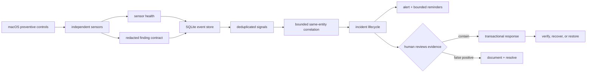

# Aegis layered-defense architecture

## Security objective

Aegis is a local macOS **Observer** with human-approved response. Its job is not
to make one detector look infallible; it is to arrange independent, imperfect
controls so that an attack missed by one layer can still leave evidence in
another. A sensor failure is data, never a clean result.

The non-negotiable boundary is:

- Observer Basic may sample, diff, correlate, alert, quarantine a named object,
  and recover that object. It does not authorize process, file, or network events.
- It does not request root or Full Disk Access for a shared interpreter.
- It does not execute suspect samples on the host.
- It does not let an LLM or heuristic automatically take response authority.
- Power-tier blocking requires a dedicated signed/notarized app, Apple-approved
  Endpoint Security entitlement, system-extension activation, and a separate
  Network Extension if network filtering is added.

## Swiss-cheese layers

| Layer | Control | Failure it covers |
|---|---|---|
| Prevent | Gatekeeper/notarization posture, SIP, FileVault, firewall, least privilege | Reduces exposed paths before Aegis observes anything |
| Observe | Persistence, processes/argv, hot directories/apps, XProtect, staging, shell history, hosts-file web/phishing posture, canaries, listeners, background items, profiles, extensions, wallet integrity | Independent artifacts left by execution, persistence, credential theft, staging, redirection, or tampering |
| Prove coverage | Durable per-sensor status, duration, item count, consecutive failures | Prevents an unavailable permission/tool from being reported as clean |
| Normalize | Versioned finding contract and central redaction | Makes signals comparable without persisting command-line secrets |
| Correlate | Same-entity, bounded-window chains | Raises confidence when independent layers agree without flooding on unrelated medium findings |
| Manage | Durable incidents, evidence links, validated lifecycle, bounded reminders | Keeps work visible after a desktop notification disappears |
| Contain | Manual process action and transactional file/app quarantine | Stops a reviewed threat while retaining reversible evidence |
| Recover | Exclusive restore, verified delete, crash recovery, audit | Handles false positives and interrupted response without silent data loss |

## Data and decision flow



Every observation becomes an `events` row. A stable fingerprint upserts a
`signals` row and increments its occurrence count. High-confidence related
signals can share an incident; the event-to-incident links preserve the evidence
that justified escalation. Raw events are bounded while materialized signals,
incidents, and response transactions remain durable.

## Correlation rules

The current rules intentionally trade breadth for explainability:

- **ClickFix/fileless execution:** fetch-and-execute behavior plus persistence
  involving the same entity becomes a CRITICAL chain.
- **Persistence execution:** a persistence change plus risky execution of the
  same entity becomes a CRITICAL chain.
- **Remote access:** persistence changes plus a newly reachable
  listener for the same entity become a CRITICAL chain.
- **Supply chain:** background-item installation/change plus suspicious
  execution of the same entity becomes a CRITICAL chain.

An uncorrelated HIGH or CRITICAL signal still opens an incident. An unrelated
single MEDIUM signal is recorded but does not become an incident. Correlation is
deterministic code with inspectable evidence; it is not an AI verdict.

## Incident workflow

Allowed states are `OPEN`, `ACK`, `INVESTIGATING`, `CONTAINED`, `RECOVERING`,
`MONITORING`, `RESOLVED`, and `FALSE_POSITIVE`. Transitions are validated so a
closed incident cannot silently return to containment. An unresolved incident
gets at most three reminders (about +1 hour, +24 hours, and +72 hours); afterward
the durable open state is the reminder.

```text
OPEN -> ACK -> INVESTIGATING -> CONTAINED -> RECOVERING -> MONITORING -> RESOLVED
                         \------------------------------------------> FALSE_POSITIVE
```

Use `aegis.py incidents`, then `aegis.py incident ID ACTION`. Response remains a
separate explicit step; creating an incident never quarantines or kills anything.

## Transactional quarantine

Each quarantine item owns an authoritative `txn.json`. The manifest is rebuilt
from those transactions and can be deleted without losing authority.

1. Validate the exact object: regular file or structurally valid `.app`, one
   link, no external aliases/special files, not a symlink/protected path,
   unchanged identity, same filesystem.
2. Persist and flush `PREPARED`; append and flush the pre-mutation audit record.
3. Exclusively rename the native object into `sealed/payload` and sync both
   directories. No copy-then-delete path is used.
4. Verify device/inode/type/content identity; persist `QUARANTINED`; seal the
   container with mode `000`; append the terminal audit record.
5. On startup or before any response, recover interrupted phases idempotently.

Restore and destroy likewise persist intent before mutation. Restore uses an
exclusive rename and chooses a unique destination if the original name is
occupied. Destroy verifies deletion but does not claim secure erase on APFS/SSD.

## Operational invariants

- System tools resolve to absolute Apple paths and run with a fixed system PATH.
- State directory/file modes are `0700`/`0600`; runtime is installed atomically.
- Automatic scan/watch never calls VirusTotal; manual `vt` sends only a SHA-256.
- Web/phishing posture parses local `/etc/hosts` only; it neither downloads nor
  installs third-party policy and never mistakes invisible DNS/NE coverage for
  confirmed absence.
- Logs rotate to bound storage. Sensitive values are redacted before persistence.
- Watch mode is event-assisted, debounced, rate-limited, and always reconciles
  on a periodic full scan; vnode notification is not treated as a complete log.
- `doctor` exposes permission and sensor degradation. Three consecutive sensor
  failures open one health incident; recovery resolves it and resets the count.
- Capability-dependent inventories such as Background Task Management remain
  DEGRADED when macOS requires interactive authorization; denied data is never
  interpreted as an empty or clean snapshot.
- Uninstall retains evidence by default. Purge requires the explicit `--purge`.

## Power-tier gate

Do not add pseudo-blocking through privileged shell loops. The legitimate path
is a dedicated macOS app with hardened runtime, notarization, a supervised ES
system extension, explicit user activation, and fail-safe rollout:

1. ES `NOTIFY` events in shadow mode only.
2. Measure event loss, handler deadlines, resource bounds, and false positives.
3. Add only narrow, deterministic `AUTH` rules whose failure policy is explicit.
4. Keep detection/correlation outside the authorization deadline.
5. Add a Network Extension separately if outbound filtering is justified.

Until those gates are satisfied, Observer Basic must remain honest detect,
correlate, alert, and human-approved response software.

## Design references

- [NIST Cybersecurity Framework 2.0](https://tsapps.nist.gov/publication/get_pdf.cfm?pub_id=957258)
  supplies the Govern, Identify, Protect, Detect, Respond, and Recover lifecycle;
  Aegis intentionally covers multiple functions instead of equating security
  with detection count.
- [Apple Endpoint Security](https://developer.apple.com/documentation/EndpointSecurity)
  defines notification and authorization events and requires an app-packaged
  system extension.
- [Apple Endpoint Security entitlement](https://developer.apple.com/documentation/bundleresources/entitlements/com.apple.developer.endpoint-security.client)
  confirms the restricted entitlement and the not-entitled client failure.
- [Apple Network Extension content filters](https://developer.apple.com/documentation/networkextension/content-filter-providers)
  defines network allow/deny as a separate provider architecture with a privacy-
  preserving data/control split.
