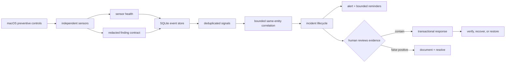

# Aegis layered-defense architecture

## Security objective

Aegis is a local **Observer** with human-approved response, running on macOS,
Linux and Windows. Its job is not to make one detector look infallible; it is
to arrange independent, imperfect controls so that an attack missed by one
layer can still leave evidence in another. A sensor failure is data, never a
clean result.

The non-negotiable boundary is:

- Observer Basic may sample, diff, correlate, alert, quarantine a named object,
  and recover that object. It does not authorize process, file, or network events.
- It does not request root/administrator or Full Disk Access for a shared interpreter.
- It does not execute suspect samples on the host.
- It does not let an LLM or heuristic automatically take response authority.
- Power-tier blocking requires OS-privileged interception the unprivileged tier
  deliberately forgoes: on macOS a signed/notarized app with the Apple-approved
  Endpoint Security entitlement (plus a Network Extension for filtering); on
  Linux a root-privileged eBPF/fanotify/audit agent; on Windows a kernel
  minifilter or an ELAM/PPL-signed AV service registered with the OS.

## Platform strategy

One stdlib-only file detects its OS at import and selects the sensor registry,
path tables, trust model, scheduler and change-detection mechanism for that OS.
Three rules keep this honest rather than merely portable:

1. **A sensor with no meaning on a platform is absent, not degraded.** Reporting
   a launchd check as a failed sensor on Linux would manufacture a permanent
   fake coverage gap and train the operator to ignore health warnings.
2. **The trust model is per-OS, because "who vouches for this binary" genuinely
   differs.** macOS and Windows have ambient code signing, so unsigned/ad-hoc in
   a user-writable path is itself the signal. Linux has none — every locally
   built binary is unowned by any package — so treating "unmanaged" as
   suspicious would bury a developer in false positives. Linux therefore keys
   its exec signal on *structure* instead: execution from a volatile directory,
   or a running process whose executable has been unlinked from disk.
3. **Everything above the sensor line is shared.** The finding contract,
   redaction, event store, dedup, correlation and path lineage, incident
   lifecycle, typed dismissals, risk accumulation, sensor health, the
   transactional quarantine store, replay, and the heartbeat all operate on
   platform-neutral records, so a detection cannot be well-managed on one OS
   and sloppily managed on another.

## Swiss-cheese layers

| Layer | Control | Failure it covers |
|---|---|---|
| Prevent | Per-OS preventive posture: Gatekeeper/SIP/FileVault/firewall (macOS), SELinux-AppArmor/ufw-firewalld-nftables/LUKS/sshd exposure (Linux), Defender RTP + tamper protection/firewall profiles/BitLocker (Windows) | Reduces exposed paths before Aegis observes anything |
| Observe | Persistence, processes/argv, hot directories, staging, shell + PowerShell history, hosts-file web/phishing posture, canaries, listeners, outbound, extensions, wallet integrity, developer supply chain — plus the OS-specific surfaces: XProtect/BTM/profiles (macOS), kernel modules and setuid-root binaries (Linux), WMI subscriptions and Defender exclusions (Windows) | Independent artifacts left by execution, persistence, credential theft, staging, redirection, or tampering |
| Attribute | Download provenance from `QuarantineEventsV2` and the Chrome-family `downloads` table (macOS); OS security-log harvest elsewhere (`auth.log`/journal on Linux, the Security/Defender/PowerShell event channels on Windows) | Turns "an unsigned binary appeared" into "who fetched it, from where" — and grades the finding accordingly |
| Prove coverage | Durable per-sensor status, duration, item count, consecutive failures | Prevents an unavailable permission/tool from being reported as clean |
| Normalize | Versioned finding contract and central redaction | Makes signals comparable without persisting command-line secrets |
| Correlate | Same-entity bounded-window chains **plus durable path lineage** | Raises confidence when independent layers agree; lineage additionally links a drop to an execution that happens after any bounded window has closed |
| Manage | Durable incidents, evidence links, validated lifecycle, bounded reminders | Keeps work visible after a desktop notification disappears |
| Tune | Typed dismissals (false- vs benign-positive), per-sensor down-weighting, documented benign causes, read-only replay | Keeps the operator trusting the tool: a noisy detector is measurable and correctable instead of being muted wholesale |
| Pre-commit | Latched persistence surfaces (`chflags uchg` / deny-write ACE) and FIFO credential decoys, both placed **before** any attack | Makes the attacker's write fail rather than reporting it afterwards; a cleared latch or a read decoy is attack-defined evidence |
| Contain | Manual process action, **reversible freeze**, and transactional file/app quarantine | Stops a reviewed threat while retaining reversible evidence |
| Prove detection | Positive-control assay per detector, with an efficacy half-life | Distinguishes "nothing found" from "no longer able to find"; unproven coverage is reported as unproven |
| Delegate-surface | Agent config discovered by **shape** (a `command`+`args` pair under an agent directory), hashed by **resolved target** rather than by config line, plus a semantic imperative detector for instruction files and git-derived provenance for each added line | An AI agent runs with the operator's full authority and takes instruction from files; an MCP registration is exec-on-start, a hook body is exec-per-tool-call, and a natural-language imperative is an execution primitive with no shell syntax for any grammar to match |
| Session | Browser automation aimed at the **live** profile (debug port, sideloaded extension, real `--user-data-dir`), plus session-binding posture | Post-App-Bound-Encryption, cookie theft is the browser being driven against itself rather than a jar being copied; live cookies defeat MFA and their revocation belongs to the counterparty |
| Recover-plan | Dependency-ordered revocation derived from the credential artifacts actually present on disk | The question after a theft is not "what happened" but "which accounts are theirs, in what order do I take them back" — and rotating in the wrong order hands over the reset link |
| Witness | Hash-chained state anchored into the OS's root-owned log store | An attacker who tampers, or who stops the monitor, cannot do so silently |
| Recover | Exclusive restore, verified delete, crash recovery, audit | Handles false positives and interrupted response without silent data loss |

## Data and decision flow



Every observation becomes an `events` row. A stable fingerprint upserts a
`signals` row and increments its occurrence count. High-confidence related
signals can share an incident; the event-to-incident links preserve the evidence
that justified escalation. Raw events are bounded while materialized signals,
incidents, and response transactions remain durable.

## Correlation rules

The current rules intentionally trade breadth for explainability:

- **ClickFix/fileless execution:** fetch-and-execute behavior plus persistence
  involving the same entity becomes a CRITICAL chain.
- **Persistence execution:** a persistence change plus risky execution of the
  same entity becomes a CRITICAL chain.
- **Remote access:** persistence changes plus a newly reachable
  listener for the same entity become a CRITICAL chain.
- **Supply chain:** background-item installation/change plus suspicious
  execution of the same entity becomes a CRITICAL chain.
- **Credential capture:** a password phish, `dscl -authonly` check, keychain
  access, or GUI-kill coercion, plus persistence/staging/exfil on the same
  entity, becomes a CRITICAL chain. Each stage is individually explainable;
  together they are the infostealer kill chain.
- **Path lineage (not time-boxed):** a suspicious drop is remembered durably by
  normalized path, and any later execution or persistence of that path becomes a
  CRITICAL chain regardless of elapsed time.

An uncorrelated HIGH or CRITICAL signal still opens an incident. An unrelated
single MEDIUM signal is recorded but does not become an incident. Correlation is
deterministic code with inspectable evidence; it is not an AI verdict.

### Why lineage is keyed on the path

The bounded window cannot express the standard 2025-26 sequence: a dropper writes
a payload and exits, and a *different* launchd job executes it at the next login.
Widening the window trades precision for a case it still would not reliably
cover. Content hashes are also the wrong key, because droppers re-sign the
payload between stages, changing the hash while the code stays identical. The
path is the one identifier that must remain stable for the attack to function, so
lineage joins on it — retained for six months, then forgotten.

### Risk accumulation

Weak signals that never notify alone accumulate per entity, weighted by severity
× confidence. Two refinements keep this honest:

- **Corroboration is scored, not just counted.** Signals from two or more
  distinct sensors receive a score multiplier against a *constant* threshold —
  independent sensors agreeing is stronger evidence than the same count from one
  sensor. The single-sensor path keeps its original bar, so no previously
  escalating detection stops escalating.
- **Precision feedback.** A category the operator repeatedly dismisses is
  down-weighted toward a floor (never to zero, so it can still corroborate), and
  only after a minimum sample, so one dismissal cannot mute a sensor. Reopening
  an incident retracts its dismissal.

## Incident workflow

Allowed states are `OPEN`, `ACK`, `INVESTIGATING`, `CONTAINED`, `RECOVERING`,
`MONITORING`, `RESOLVED`, and `FALSE_POSITIVE`. Transitions are validated so a
closed incident cannot silently return to containment. An unresolved incident
gets at most three reminders (about +1 hour, +24 hours, and +72 hours); afterward
the durable open state is the reminder. A reviewed `FALSE_POSITIVE` suppresses
only the exact correlation key while retaining later occurrences as evidence;
a changed content hash gets a new key. A `RESOLVED` threat that recurs opens a
new incident instead of being silently ignored.

```text
OPEN -> ACK -> INVESTIGATING -> CONTAINED -> RECOVERING -> MONITORING -> RESOLVED
                         \------------------------------------------> FALSE_POSITIVE
```

Use `aegis.py incidents`, then `aegis.py incident ID ACTION`. Response remains a
separate explicit step; creating an incident never quarantines or kills anything.

Dismissal is **typed**, because the two kinds need opposite handling and merging
them is what makes a detector impossible to tune:

- `false-positive` — the detection logic was wrong; the rule needs tuning.
- `benign-positive` — the event was real but authorized; the rule is working.

Both suppress the same way (identical semantics, `FALSE_POSITIVE`), but they are
recorded separately so the tuning queues and the per-sensor precision feedback
can tell a broken rule from an expected-but-noisy one. Each incident card also
prints the documented benign causes for the sensors that fired, so triage is a
match against a known list rather than an investigation.

`aegis.py replay [days]` re-runs the current correlation logic over recorded
history in a throwaway in-memory database. It is strictly read-only — no
incident, no notification, no durable write — so a detection change can be
backtested before it ships.

## Transactional quarantine

Each quarantine item owns an authoritative `txn.json`. The manifest is rebuilt
from those transactions and can be deleted without losing authority.

1. Validate the exact object: regular file or structurally valid `.app`, one
   link, no external aliases/special files, not a symlink/protected path,
   unchanged identity, same filesystem.
2. Persist and flush `PREPARED`; append and flush the pre-mutation audit record.
3. Exclusively rename the native object into `sealed/payload` and sync both
   directories. No copy-then-delete path is used.
4. Verify device/inode/type/content identity; persist `QUARANTINED`; seal the
   container with mode `000`; append the terminal audit record.
5. On startup or before any response, recover interrupted phases idempotently.

Restore and destroy likewise persist intent before mutation. Restore uses an
exclusive rename and chooses a unique destination if the original name is
occupied. Destroy verifies deletion but does not claim secure erase on APFS/SSD.

## Operational invariants

- System tools resolve to absolute Apple paths and run with a fixed system PATH.
- State directory/file modes are `0700`/`0600`; runtime is installed atomically.
- Automatic scan/watch never calls VirusTotal; manual `vt` sends only a SHA-256.
- **No parser above the user.** Untrusted input is never parsed at a privilege
  its author does not already hold. This is the corrected form of the older "no
  new privileged parser" wording, which was broader than its justification: the
  Norton/Symantec CVE-2016-2208 parser was dangerous because it ran as SYSTEM, so
  a bug in it escalated. A parser at the same privilege as the file's owner
  escalates nothing. Parsing the operator's own JSON/TOML config is therefore
  in-scope; parsing untrusted binaries is not.
- **Human authorization must not be satisfiable by automation.** An `isatty()`
  check is not sufficient — anything that allocates a pty (`expect`, `script`,
  an agent's shell tool) passes it and can read a code printed to that terminal.
  The challenge channel and the response channel must therefore be different,
  and where no out-of-band channel exists the weaker guarantee is *recorded*
  (`channel=tty-only` in `actions.jsonl`), never claimed as equivalent.
- **Presence is evidence, never a control input.** Idle/lock state is forgeable
  by a same-uid process, so it may enrich a finding and must never license an
  automatic action. Any measurement an attacker can drive is a remote control if
  an automated decision reads it.
- Web/phishing posture parses local `/etc/hosts` only; it neither downloads nor
  installs third-party policy and never mistakes invisible DNS/NE coverage for
  confirmed absence.
- Logs rotate to bound storage. Sensitive values are redacted before persistence.
- Watch mode is event-assisted, debounced, rate-limited, and always reconciles
  on a periodic full scan; vnode notification is not treated as a complete log.
- `doctor` exposes permission and sensor degradation. Three consecutive sensor
  failures open one health incident; recovery resolves it and resets the count.
- Capability-dependent inventories such as Background Task Management remain
  DEGRADED when macOS requires interactive authorization; denied data is never
  interpreted as an empty or clean snapshot.
- Uninstall retains evidence by default. Purge requires the explicit `--purge`.

## Protective tier (opt-in, by hand)

The detect tier answers "what happened". The protective tier is the answer to
the limitation that produces: an unprivileged process cannot **veto** an event,
because a veto is irreversible and only the kernel may arbitrate one. Three
things it *can* do, none of which require privilege:

1. **Pre-commit.** Claim the surface before the attacker reaches it. `chflags
   uchg` on macOS and a deny-write ACE on Windows are settable by the file's own
   owner with no privilege; a dropper's write then fails outright. Linux has no
   unprivileged immutable flag (`chattr +i` needs `CAP_LINUX_IMMUTABLE`), so
   there a latch is a mode change — a speed bump, documented as one, never sold
   as equivalent. The detection half is what makes this more than hardening:
   nothing benign clears a latch, so a latch found cleared with no authorized
   `unlatch` is attack-defined evidence rather than a heuristic. `unlatch`
   therefore refuses non-interactive callers and requires a typed one-time code
   — if a script could call it, malware could call it, and the signal would be
   worth nothing.

2. **Contain reversibly.** `freeze` suspends a same-user process tree
   (`SIGSTOP` / `NtSuspendProcess`). The asymmetry that makes this work: a veto
   must be privileged *because* it is irreversible, whereas a freeze can be
   taken back, so it needs no arbitration and no privilege — and because being
   wrong costs one `thaw`, it can act on evidence far weaker than any
   irreversible action could justify. The root is suspended first, since a
   stopped parent cannot fork, which turns an unbounded chase into a converging
   sweep; a tree still growing after the pass cap is reported as such rather
   than presented as a tidy containment. Guards: never another user's process,
   never a session-critical one, and never an **ancestor** of Aegis — suspending
   the shell or terminal is indistinguishable from a hung machine. An
   unreviewed freeze auto-releases (**fail-open, deliberately**): a monitor that
   can silently leave your processes stopped forever is a worse failure than one
   that lets a suspect resume.

   Stated limit: freeze stops new reads, connections and forks. It does not
   un-send bytes already handed to the kernel's socket buffers. It contains an
   attack in progress; it does not rewind one.

3. **Witness.** Every scan extends a hash chain over Aegis's own state and
   anchors one line into the platform's log store — root-owned on every
   supported OS, so a same-uid attacker may append but cannot edit or erase.
   The claim is deliberately split, because the two halves are not equally
   strong: **erasure-resistant** (removing an anchor needs root, so a gap is
   real evidence) but only **partly forgery-resistant** (an attacker who reads
   `hmac.key` — which a same-uid attacker can — may write a consistent local
   chain and matching anchors). What they cannot do is make a *past* anchor say
   something else, so rewriting history or silencing the monitor both leave
   evidence. `notary verify` prints which of the two it actually proved.

The invariant that does **not** move: nothing here fires automatically from a
heuristic. Every verb is one the operator types after reviewing a finding, on
the same footing as quarantine/kill/neutralize. What changed is that the
operator now has reversible verbs available, not that Aegis acquired judgement.

Coverage itself is measured rather than asserted: `assay` challenges each
detector with an inert, nonce-tagged synthetic stimulus and records what is
currently *proven*. A control unproven past its half-life is reported as
unproven coverage, never as a clean result. It deliberately uses no EICAR —
waking a third-party AV would trip Aegis's own file-deletion sensors, a
self-referential cascade in a tool whose whole value is a calm signal.

## Power-tier gate

Do not add pseudo-blocking through privileged shell loops. The legitimate path
is a dedicated macOS app with hardened runtime, notarization, a supervised ES
system extension, explicit user activation, and fail-safe rollout:

1. ES `NOTIFY` events in shadow mode only.
2. Measure event loss, handler deadlines, resource bounds, and false positives.
3. Add only narrow, deterministic `AUTH` rules whose failure policy is explicit.
4. Keep detection/correlation outside the authorization deadline.
5. Add a Network Extension separately if outbound filtering is justified.

Until those gates are satisfied, Observer Basic must remain honest detect,
correlate, alert, and human-approved response software.

## Design references

- [NIST Cybersecurity Framework 2.0](https://tsapps.nist.gov/publication/get_pdf.cfm?pub_id=957258)
  supplies the Govern, Identify, Protect, Detect, Respond, and Recover lifecycle;
  Aegis intentionally covers multiple functions instead of equating security
  with detection count.
- [Apple Endpoint Security](https://developer.apple.com/documentation/EndpointSecurity)
  defines notification and authorization events and requires an app-packaged
  system extension.
- [Apple Endpoint Security entitlement](https://developer.apple.com/documentation/bundleresources/entitlements/com.apple.developer.endpoint-security.client)
  confirms the restricted entitlement and the not-entitled client failure.
- [Apple Network Extension content filters](https://developer.apple.com/documentation/networkextension/content-filter-providers)
  defines network allow/deny as a separate provider architecture with a privacy-
  preserving data/control split.
